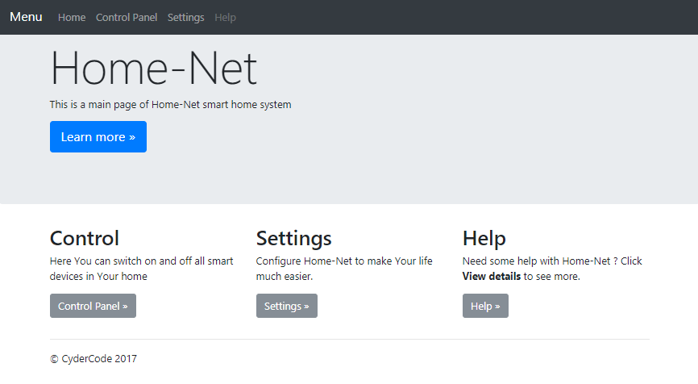
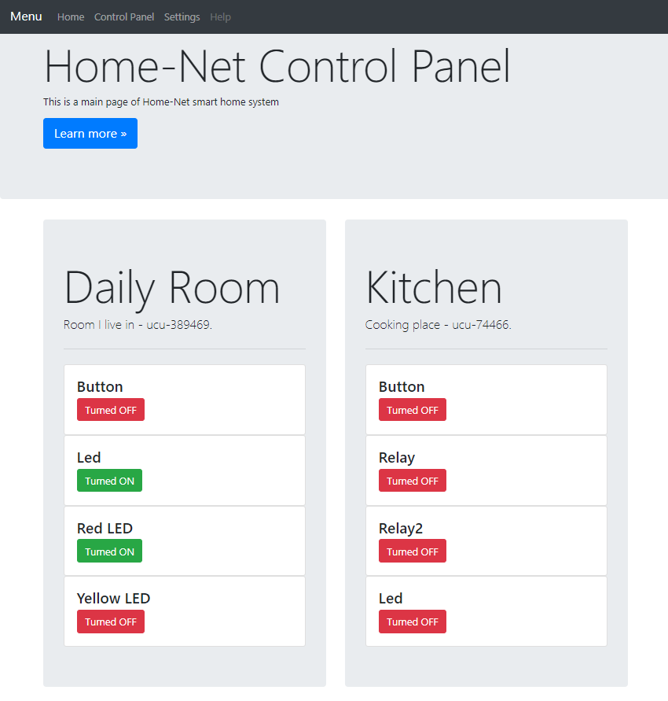

# Home-Net
What is Home-Net? Home-Net is a project which will make Your Home Smart :) 
With Home-Net You can script Your devices in JavaScript and Control them from WEB.

# Screenshots
## Home-Net: Main Page


## Home-Net: Control Panel



# Configuring system and running UMU
## Network Configuration
MQTT Broker has to be configured with static IP.
To do this, please reconfigure Your /etc/dhcpcd.conf file as follows:

```bash
interface wlan0
static ip_address 192.168.0.10/24
static routers=192.168.0.1
static domain_name_servers=127.0.0.1 8.8.8.8 8.8.4.4
```

## TimeZone Configuration
Please remember to set Your timezone on Linux where UMU is installed. 
This is important because You can use time in Javascript flows. 
For example hour is used to determine if turn lights on when motion is detected.

```bash
sudo dpkg-reconfigure tzdata
```

## Start MQTT broker
Please a compatible MQTT broker for the homenet infrastructure. 
I suggest to use Mosquitto. 
You can run install it and run using following command: 

```bash
service mosquitto start
```

## Install Grafana and Influx DB
* Install InfluxDB
```bash
apt-get install influxdb
```

* Check the status of grafana service
```bash
service influxd status
```
You can also open web interface of influxdb: **http://host:8083**

* Install and start the Grafana
```bash
apt-get install grafana
service grafana-server start
```

* Check the status of Grafana **http://host:3000**


## Run UMU server
Execute following command in **homenet-server** directory
```bash
maven spring-boot:run
```

# MQTT Topics
This is description of MQTT topics used by HomeNet UCU and UMU. 

| Topic name          | Description                                                                    | Message class        |
|---------------------|--------------------------------------------------------------------------------|----------------------|
| /ucu/gpio/configure | configure gpio direction, input output pullup                                  | ConfigureGpioMessage |
| /ucu/gpio/set       | set value for gpio on ucu                                                      | SetGpioValueMessage  |
| /umu/gpio/set       | gpio value changed on ucu                                                      | SetGpioValueMessage  |
| /ucu/hello          | request to all ucus to send message to umu with instance names                 | HelloMessage         |
| /umu/hello          | all ucus can introduce themselfs to umu                                        | HelloMessage         |
| /umu/error          | ucu sends to this topic information about errors                               | ErrorMessage         |
| /umu/ping           | ucus sends ping message as answer for ping message from umu                    | PingMessage          |
| /ucu/ping           | umu send ping request to all ucus                                              | PingMessage          |

# UCU Connector
| Signal    | Wire Color    | Connector Pin     |
|-----------|---------------|-------------------|
| 5V        | Red           | 1                 |
| 3.3V      | White         | 2                 |
| IO        | Blue          | 3                 |
| GND       | Black         | 4                 |
  

# LCU - Light Control Unit - Specification
* One 230V Relay output
* Integrated 5V Power Supply
* External Reset Button - in case of BUGs in software
* External MicroUSB port - for programming
* Fixed to wall like normal light switch - using metal frame from common light switch
* External BLS 2x2 Ports for additional sensors and devices `(GND, 5V, 3.3V, GPIO)`
* Fallback to direct power to light

### NodeMCU Pin Capabilities
| IO Index  | Esp8266 pin   | OUTPUT    | INPUT             | Function          |
|-----------|-------------  |-----------|-------------------|-------------------|
| 0         | Gpio16        | X         | --- (USER Led)    | Notification LED  |
| 1         | Gpio5         | X         | X                 | IO0               |
| 2         | Gpio4         | X         | X                 | IO1               |
| 3         | Gpio0         | X         | X (Flash Button)  | IO2               |   
| 4         | Gpio2         | X         | X                 | IO3               |
| 5         | Gpio14        | X         | X                 | IO4               | 
| 6         | Gpio12        | X         | X                 | IO5               |
| 7         | Gpio13        | X         | X                 | IO6               |
| 8         | Gpio15        | X         | X/2 BOOT,NOPULLUP | Relay             |
| 11 - SD2  | Gpio9         | X         | X                 | Button A          |
| 12 - SD3  | Gpio10        | X         | X                 | Button B          |
| A0        | ADC0          | ---       | ---               | IO8               |

# UMU Configuration
```json
{
  "mqtt": {
    "host": "rpi-umu",
    "port": 1883
  },
  "instances": [
    {
      "id": "ucu-389469",
      "name": "Daily Room",
      "description": "Room I live in",
      "gpios": [
        {
          "name": "Button",
          "mode": "INPUT",
          "isPullup": true,
          "pin": 3,
          "invert": true
        },
        {
          "name": "Led",
          "mode": "OUTPUT",
          "isPullup": false,
          "pin": 4,
          "initialValue": 1,
          "invert": true
        }
      ]
    }
  ]
}
```

## HomeLets
Homelets are small Javascript application which are used to add some logic to Your home behavior. 
The api is very is simple and similar to Arduino. You have setup method and loop. 
It`s possible to add listeners for given control unit and gpio. Also it``s possible last known value of gpio or set new value of output. 

This is example homelet, responsible for turning  on the light when motion is detected or turning off when no  motion detected for 15 minutes.

```javascript
/** Consts **/
var adamsRoom = "Adam Room";
var lightRelay = "Light Relay";
var motionSensor = "Motion Sensor";

var LIGHTS_OFF_TIMEOUT = 15 * 60;

/* Global Variables */
var lastMovementTime = 0;

/* Methods */
function getTimestamp() {
    return new Date().getTime();
}

function getHours() {
    return new Date().getHours();
}

setup = function() {
    this.addListener(adamsRoom, motionSensor, function(value) {
        if(value) {
            var hour = getHours();
            if(hour >= 18 && hour <= 22) {
                this.setValue(adamsRoom, lightRelay, 0);
            }
        }
    });
}

loop = function() {

    var motionSensorValue = this.getValue(adamsRoom, motionSensor);
    var currentTimestamp = getTimestamp();

    if(motionSensorValue) {
        lastMovementTime = currentTimestamp;
    }

    var secondsElapsed = (currentTimestamp - lastMovementTime) / 1000;
    if(secondsElapsed > LIGHTS_OFF_TIMEOUT) {
        this.setValue(adamsRoom, lightRelay, 1);
    }
}
```

# UCU Configuration
Every UCU has embedded configuration server service. 

It exposes WIFI Access Point with Http server. AP will be automatically disabled after 60 seconds after boot time.
Name of AP is the same as chipid (instanceId). 

To configure UCU You should connect with UCU with WiFi and send following http request:
## UCU Configuration Http Request
* host: `192.168.4.1`
* port: `80`
* method: `POST`
* path: `/`
* headers:
    * **ssid** - wifi SSID
    * **password** - wifi PASSWORD
    * **mqtt-host** - MQTT Broker Host
    * **mqtt-port** - MQTT Broker Port
